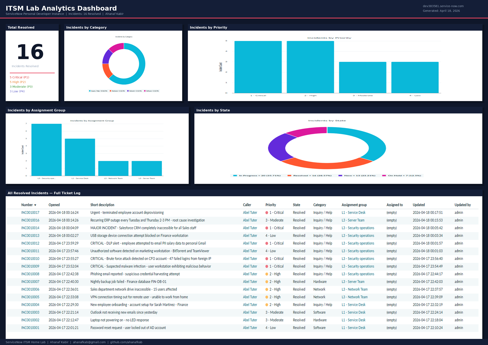

# 🎫 ServiceNow ITSM Home Lab

> A fully documented IT Service Management simulation built on a ServiceNow Personal Developer Instance (PDI). Designed to demonstrate real-world helpdesk, incident response, and security operations experience for entry-level IT and SOC analyst roles.

---

## 📊 Project Overview

| Detail | Value |
|--------|-------|
| **Platform** | ServiceNow PDI (dev383581.service-now.com) |
| **Modules Used** | Incident Management, Problem Management, Change Management, Knowledge Base, SLA Management, Platform Analytics |
| **Total Tickets** | 16 resolved incidents |
| **Priority Range** | P1 Critical through P4 Low |
| **Security Incidents** | 6 (including 3 P1 Criticals) |
| **Duration** | April 2026 |

---

## 🖥️ Dashboard



---

## 🔧 Environment Configuration

Before creating any tickets, the ServiceNow instance was configured to simulate a realistic corporate IT environment.

### Assignment Groups Created

| Group | Tier | Responsibility |
|-------|------|---------------|
| L1 - Service Desk | L1 | First-line support, basic troubleshooting |
| L2 - Desktop Support | L2 | Hands-on hardware and software support |
| L3 - Network Team | L3 | Network infrastructure and connectivity |
| L3 - Security Operations | L3 | Security incidents and investigations |
| L3 - Database Admins | L3 | Database access and performance |
| L3 - Server Team | L3 | Server infrastructure management |
| Change Advisory Board | CAB | Reviews and approves change requests |

### SLA Policies Configured

| Priority | Response Time | Resolution Time |
|----------|--------------|-----------------|
| P1 - Critical | 15 minutes | 4 hours |
| P2 - High | 30 minutes | 8 hours |
| P3 - Moderate | 2 hours | 24 hours |
| P4 - Low | 4 hours | 72 hours |

### Knowledge Base Articles Created

| Article | Topic |
|---------|-------|
| KB0010001 | How to Reset Your Password via Self-Service Portal |
| KB0010002 | Troubleshooting VPN Connectivity Issues |
| KB0010003 | How to Identify and Report a Phishing Email |
| KB0010004 | How to Request Software Installation |
| KB0010005 | Wi-Fi Troubleshooting for Corporate Laptops |

---

## 🎟️ Incident Tickets

### Phase 1 — General IT Support

| Ticket | Short Description | Priority | Assignment Group | Resolution |
|--------|-------------------|----------|-----------------|------------|
| INC0010001 | Password reset — user locked out of AD account | P4 - Low | L1 - Service Desk | Verified identity, unlocked AD account, reset password |
| INC0010002 | Laptop not powering on — no LED response | P3 - Moderate | L1 - Service Desk | Confirmed hardware failure, escalated to L2, issued loaner |
| INC0010003 | Outlook not receiving new emails since yesterday | P3 - Moderate | L1 - Service Desk | Mailbox at 96% quota — archived 8GB, email flow restored |
| INC0010004 | New employee onboarding — Finance department | P2 - High | L1 - Service Desk | Full provisioning: AD, email, VPN, SAP, laptop imaged |

### Phase 2 — Network & Infrastructure

| Ticket | Short Description | Priority | Assignment Group | Resolution |
|--------|-------------------|----------|-----------------|------------|
| INC0010005 | VPN connection timing out for remote user | P2 - High | L3 - Network Team | Outdated VPN client + expired certificate — both remediated |
| INC0010006 | Sales network drive inaccessible — 15 users affected | P2 - High | L3 - Network Team | Sales group inadvertently removed from share permissions — restored |
| INC0010007 | Nightly backup failure — Finance database FIN-DB-01 | P2 - High | L3 - Server Team | Backup volume at 98% — archived old backups, re-ran job successfully |

### Phase 3 — Security Incidents ⚠️

| Ticket | Short Description | Priority | Assignment Group | Resolution |
|--------|-------------------|----------|-----------------|------------|
| INC0010008 | Phishing email reported — suspicious credential harvesting | P2 - High | L3 - Security Operations | Sender blocked, emails recalled from 47 mailboxes, 2 users who clicked escalated |
| INC0010009 | **CRITICAL** — Suspected malware infection, workstation WS-MKT-007 | P1 - Critical | L3 - Security Operations | Machine isolated, Trojan.GenericKD.47821 found, wiped and reimaged, credentials reset |
| INC0010010 | **CRITICAL** — Brute force attack on CFO account — 47 failed logins | P1 - Critical | L3 - Security Operations | Account disabled, IP blocked at firewall, MFA enforced on all exec accounts |
| INC0010011 | Unauthorized software detected — BitTorrent and TeamViewer | P3 - Moderate | L3 - Security Operations | Software removed, connection logs reviewed, user and manager notified |
| INC0010012 | **CRITICAL** — DLP alert, employee attempted to email PII salary data | P1 - Critical | L3 - Security Operations | Transmission blocked, prior exfil of 12 records confirmed, Legal and HR notified, compliance engaged |
| INC0010013 | USB storage device connection attempt blocked — Finance workstation | P3 - Moderate | L3 - Security Operations | Block confirmed, no data transferred, user educated on removable media policy |

### Phase 4 — Escalation & Change Management

| Ticket | Short Description | Priority | Assignment Group | Resolution |
|--------|-------------------|----------|-----------------|------------|
| INC0010014 | **MAJOR INCIDENT** — Salesforce CRM inaccessible for 50 Sales users | P1 - Critical | L3 - Security Operations | ISP-side outage on NA72 instance, bridge call established, restored after 97 min |
| INC0010015 | Emergency change — deploy zero-day patch CVE-2026-29891 to 30 servers | P1 - Critical | Change Advisory Board | Emergency CAB approval, all 30 servers patched overnight, vulnerability confirmed remediated |
| INC0010016 | Recurring ERP outage every Tues/Thurs — root cause investigation | P2 - High | L3 - Server Team | RCA: DB index rebuild job running during business hours consuming 94% RAM — rescheduled to 1 AM |
| INC0010017 | Urgent — terminated employee account deprovisioning | P2 - High | L1 - Service Desk | Full deprovisioning in 40 min: AD, VPN, email, Jira, GitHub, AWS, Slack, badge all revoked |

---

## 📈 Analytics & Metrics

### Reports Built

| Report | Type | Key Finding |
|--------|------|-------------|
| Incidents by Category | Donut Chart | Inquiry/Help 62.5%, Hardware 12.5%, Network 12.5%, Software 12.5% |
| Incidents by Priority | Bar Chart | 5 Critical, 5 High, 3 Moderate, 3 Low |
| Incidents by Assignment Group | Bar Chart | L3 Security Operations handled the most tickets (7) |
| Incidents by State | Donut Chart | 16 Resolved (28.57% of all instance tickets) |
| Total Resolved Incidents | Single Score | 16 |
| All Resolved Incidents | List View | Full ticket log with priority, category, and assignment group |

---

## 🔐 Security Incident Highlights

This lab placed heavy emphasis on security-relevant incident handling to bridge IT support and cybersecurity operations.

### Malware Containment (INC0010009)
- Immediately isolated workstation from network upon report
- Ran endpoint AV scan in isolation — identified `Trojan.GenericKD.47821` and `Adware.BrowseFox`
- Documented IOCs: malware name, C2 domains (`update-srv.xyz`, `pdf-tools.net`)
- Escalated to Security Operations for forensic imaging
- Workstation wiped and reimaged, all credentials reset as precaution
- C2 domains blocked at perimeter firewall

### Brute Force Attack Response (INC0010010)
- SIEM alert: 47 failed login attempts in 10 minutes from IP `185.220.101.47` (Eastern Europe)
- Account disabled within 1 minute of alert
- Verified no successful authentications in logs
- Confirmed CFO physically present in office — confirmed not his attempts
- MFA enforced across all executive accounts post-incident
- Full incident report filed with Security Operations

### DLP Data Exfiltration (INC0010012)
- DLP system blocked outbound email containing `Q3_Employee_Salaries_Full.xlsx` (214 employee records with SSNs)
- Log review revealed prior successful transmission of 12 records 2 weeks earlier
- Account suspended, HR and Legal notified within 30 minutes
- Compliance team engaged for breach notification assessment
- Forensic review completed by Security Operations

---

## 🛠️ Skills Demonstrated

- **Incident Management** — Full ticket lifecycle from creation through resolution with detailed work notes
- **Security Incident Response** — Containment, investigation, escalation, and documentation of P1 security events
- **Triage & Prioritization** — Applied P1-P4 SLA framework across all ticket categories
- **Escalation Procedures** — Proper handoff notes to L2/L3 teams with diagnostic history
- **Change Management** — Emergency change request with CAB approval and rollback planning
- **Problem Management** — Root cause analysis linking recurring incidents to underlying cause
- **Knowledge Management** — Created 5 KB articles linked to relevant ticket resolutions
- **ITSM Administration** — Configured assignment groups, SLA policies, and analytics reports
- **Reporting & Analytics** — Built 6 custom reports and a metrics dashboard in ServiceNow

---

## 📁 Repository Structure

```
servicenow-itsm-lab/
├── README.md
├── dashboard/
│   └── ITSM_Dashboard.png
├── configuration/
│   ├── day1-fresh-instance.png
│   ├── day1-groups-configured.png
│   ├── day1-sla-definitions.png
│   └── kb-articles-complete.png
├── tickets/
│   ├── phase1-general-it/
│   │   ├── ticket-01-resolved.png
│   │   ├── ticket-02-resolved.png
│   │   ├── ticket-03-resolved.png
│   │   └── ticket-08-resolved.png
│   ├── phase2-network-infrastructure/
│   │   ├── ticket-09-resolved.png
│   │   ├── ticket-11-resolved.png
│   │   └── ticket-14-resolved.png
│   ├── phase3-security/
│   │   ├── ticket-15-resolved.png
│   │   ├── ticket-16-resolved.png
│   │   ├── ticket-17-resolved.png
│   │   ├── ticket-18-resolved.png
│   │   ├── ticket-19-resolved.png
│   │   └── ticket-20-resolved.png
│   └── phase4-escalation-change/
│       ├── ticket-21-resolved.png
│       ├── ticket-23-resolved.png
│       └── ticket-24-resolved.png
└── reports/
    ├── incidents-by-category.png
    ├── incidents-by-priority.png
    ├── incidents-by-assignment-group.png
    ├── incidents-by-state.png
    ├── total-resolved-incidents.png
    └── all-resolved-incidents.png
```

---

## 🔗 Related Projects

- [Wazuh SIEM Home Lab](https://github.com/ahanafkab/wazuh-siem-lab) — Multi-node SIEM with Active Directory, brute-force detection, and MITRE ATT&CK mapping

---

## 👤 About

**Ahanaf Kabir**
Atlanta, GA | ahanafkab@gmail.com | [github.com/ahanafkab](https://github.com/ahanafkab)

B.S. Information Technology, Cyber Operations & Security — Kennesaw State University (Expected Dec 2026)
Google Cybersecurity Certificate | CompTIA Network+ (In Progress)
